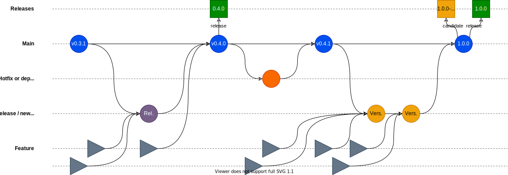

# Project construction flow

All Weather Provider Access Suite project components follow the following Git / Release flow:

## Versioning regulation

Weather Provider Access Suite project all follow the same strict rules for determining the version number an update
should get.

The version number is constructed as follows:

`<main-version>.<sub-version>.<edition><<optional>-rc>`

**For example:**
`0.2.0` `1.6.9` `2.0.3-rc`

### Version value changes

As updates occur, the version number will change in value. Changes to specific components to the version number
indicate different levels of change as follows:

- **Changes to the main-version number:**

  ***Example:** `1.1.2` to `2.0.0`*
  A change to the main-version number resets all the following numbers (sub-version and edition). Changes at this level
  indicate that the project has changed radically. New functionality may have been added. Old functionality may have
  been removed. Existing functionality may have changed in a way that requires a different methodology of access than
  before.

  **Changes at this level are very likely to breaking in nature!**

- **Changes to the sub-version number:**
  ***Example:** `1.1.2` to `1.2.0`*
  A change to the sub-version indicates simple new features or improved functionality. A change of this level should
  never include breaking changes and should only remove functionality if that is a necessity and that functionality
  cannot work anymore due to outside causes. The refactoring of multiple modules or large blocks of code may also cause
  such a change.
  *(for example: if an external resource permanently changes its format to remove data, this means that the project
  also can no longer access that data. Because the reason is external, this change to the project is then not
  considered a breaking change, but a natural result of an external event.)*

- **Changes to the edition number:**
  ***Example:** `1.1.2` to `1.1.3`*
  A change to the edition number indicates a small change. An update to dependencies, documentation or the refactoring
  of small blocks of code may cause this type of change. An edition number change should never cause functionality to
  change, and never result in a release unless it is also a hot-fix (*a fix intended to directly patch something
  critical that is no longer working*).

- **The '-rc' suffix:**

  **Example:** `1.2.0-rc`
  The suffix '-rc' is applied to indicate a release candidate. This means that the originally pushed GitHub version
  "1.2.0" repository is considered fit for release. From this version of "1.2.0" a release candidate "1.2.0-rc" will be
  constructed which will be the precursor to the eventual stable release.
  Upon release as a stable version, the release candidate version will be removed.

## Releases

Releases will always derive from the current state of the main branch. There are two types of official release:

1. **Release Candidate:**
   A pre-release that precedes an official release. The goal of this release type is to extensively test and verify
   the candidate before releasing a new version. Such a release candidate should usually be safe to use, but in rare
   cases may still contain hidden bugs that are the result of the changes implemented in the candidate. Release
   candidate versions can be recognized by their "-rc" suffix, and will be removed once their stable and verified
   counterparts are officially released.
   *(So a release candidate "1.2.0-rc" would be automatically removed upon the launch of official release "1.2.0")*
2. **Official Release:**
   The intended final release of a sub-version or completely new version. After extensive testing of a release
   candidate a stable release will be constructed. This release uses the version used by the release candidate it is
   based on.
   **Please note that version numbers always originate from the pyproject.toml file in the project.**
   This means that a version 1.2.0 may first exist as an unreleased version number in the repository, then become a
   release candidate (1.2.0-rc), and then finally be released as application version 1.2.0.

## The [main] branch

The main branch carries the current state of the project. Any and all updates to the project will converge here before
resulting in a release, even if not every version increase may result into a release.

## Hotfixes and dependency updates

These are the types of update allowed to ignore the regular process of updating and releasing. While a hotfix or
dependency update may be release via the regular process, at times these updates may be so critical in nature that an
immediate update is required to keep the project working or safe from critical exploits. In those cases a hotfix or
dependency update may need to be applied directly to the main branch. Depending on the current state of beta / regular
releases, such an update may require a direct version release to match the patch.

## Release branches

Bigger planned release packages will be gathered at a release branch, easily recognizable through the branch-name
"**release-&lt;version&gt;**". **&lt;version&gt;** here representing the intended version release number for the
release.

A release branch gathers multiple features and other updates from other branches and then is tested and patched to make
sure those features and updates to work together. After a release branch has been completed and tested, the release
will be merged into the main branch and usually start up a new release (candidate).

## Feature branches

A feature branch incorporates changes to a singular feature of the project. This can be a version update, a targeted
refactor, a new or changed project functionality or even the removal of such functionality.

A feature branch should always have a name that specifies the nature of the feature being updated and be prefixed with
"**feature/**"

For example, if we remove the functionality to format output as CSV, the title could be:

`feature/remove-csv-output-formatter`

***Quick tip:** If a quick and easy title doesn't seem possible, this may be a sign that a feature should actually be
more than one feature.*

## Testing

For Weather Provider Access Suite projects we only test for Pull Requests and releases. Any merge into a release branch
or the main branch requires testing to be fully functional and complete. Testing and test coverage result will both
need to perform sufficiently to be considered good enough by our SonarCloud configuration. Failure means that barring
some extreme situations the PR will not go through until all of the found issues have been resolved.

## Creating releases

Releases can be created via the "Releases" screen on GitHub. Creating a release candidate will generate a new release
candidate package and image using the version currently within the project's **pyproject.toml** file. Creating a full
(a.k.a. regular) release will result in all existing release candidates being removed and the release candidate with
the highest version number being used as the base for the full release.

Checks are in place to prevent a full release from being released without a release candidate, having more than 2
release candidates at a time, and re-using the same version number multiple times. In the case emergency updates the
need for a release candidate can be bypassed by starting the version description with "**--HOT-FIX--**". The other two
criteria cannot be bypassed.
